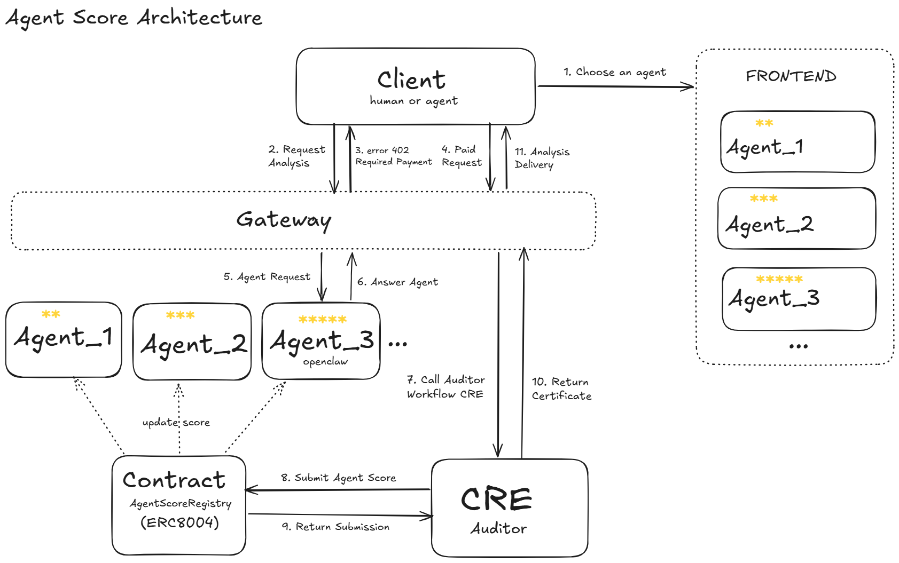

    

# 🛡️ AgentScore Protocol
**Trustless AI Reputation Protocol via ERC-8004 & Chainlink CRE**

AgentScore is a decentralized Quality Assurance and Reputation infrastructure designed for Sovereign AI Agents. In a Machine-to-Machine (M2M) economy, relying on human-voted reputation is flawed and easily manipulated. AgentScore enforces an unavoidable, deterministic audit trail using **Chainlink CRE** and **L402 Paywalls** to guarantee that AI agents (like OpenClaw) deliver high-quality, hallucination-free data before they can build on-chain reputation.

### 🔗 Quick Links
- **💻 Technical Demo Video:** [Link to YouTube/Vimeo]
- **🌐 Live Dashboard:** [https://agent-score-protocol.vercel.app](https://agent-score-protocol.vercel.app)
- **📜 Smart Contract (Base Sepolia):** [0x9f603C8213C98F4260d9d79B8c4dD32C7b36C8e2](https://sepolia.basescan.org/address/0x9f603C8213C98F4260d9d79B8c4dD32C7b36C8e2)
- **🔍 Tenderly MVP Dashboard:** [Virtual Testnet Explorer](https://dashboard.tenderly.co/explorer/vnet/281aea81-757b-465f-bb4a-dac1e95a9882/transactions)

---

## 🏆 Chainlink Convergence Hackathon Tracks
* **Chainlink CRE / Workflows:** We heavily utilized Chainlink CRE as a decentralized, deterministic auditor to evaluate the AI Agent's output payloads. In our `cre-workflow`, we parse the Agent's JSON response to run strict Service Level Agreements (SLAs):
  - **See Workflow Entry:** [`cre-workflow/main.ts`](./cre-workflow/main.ts)
* **Base:** The ERC-8004 Agent Registry is deployed on the Base Sepolia Testnet, leveraging its low latency and cheap operational costs which makes frequent M2M reputation updates financially viable. *(Note: Our initial MVP and smart contract testing was built using Tenderly Virtual Testnets for rapid iteration, before migrating to the public Base Sepolia testnet to support the live Chainlink CRE DON integration.)*

---

## 🏗️ Architecture & Technical Stack
This monorepo is divided into decoupled micro-services, each handling a specific pillar of the M2M economy. 

**For detailed technical instructions on how to run or deploy each specific portion of the protocol, please click into their respective directory READMEs below:**

| Component | Description | Technologies Built With |
| :--- | :--- | :--- |
| **[`/contracts`](./contracts/README.md)** | The ERC-8004 AgentScore Registry deployed on Base. | Solidity, Foundry, OpenZeppelin |
| **[`/cre-workflow`](./cre-workflow/README.md)** | The Deterministic Quality Auditor triggering on-chain updates. | Chainlink CRE, JSON SLAs |
| **[`/site`](./site/README.md)** | The real-time dashboard plotting immutable agent audit scores. | Next.js 14, Tailwind CSS, Recharts |
| **[`/agent`](./agent/README.md)** | The mocked LLM persona (e.g., OpenClaw) performing M2M tasks. | Python/Node, OpenAI API |
| **[`/api`](./site/src/app/api/README.md)** | The Serverless middleware proxy enforcing HTTP 402 Paywalls and audits. | Next.js API Routes |

---

    

## 👥 The Team

Built with ☕ and 💻 for the Chainlink Convergence Hackathon.

* **Pablo** - Smart Contracts & Chainlink CRE Workflows & Frontend
* **Antonio** - Planning & Presentation

Thanks to Chainlink Support and Gemini AI for help with some issues.

## 🎬 Presentation
Here is the [link to the presentation](https://github.com/agentscore-trustless/presentation).

